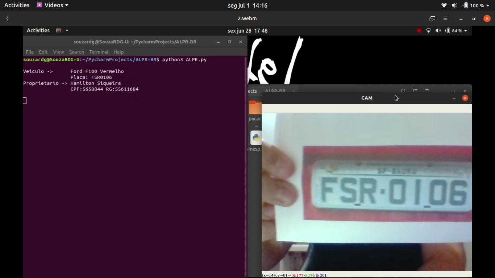

# ALPR-BR

v0.7

Brazilian ALPR using Python, OPENALPR and verifying the plate on SINESP using a API

https://youtu.be/nKeQNOoKEe4

Links to their repositories:

https://github.com/openalpr/openalpr - OpenALPR
https://github.com/victor-torres/sinesp-client - SINESP Client

Now working with the cam. first time it recognize a plate it strutter a little bit
because it needs to check the db and maybe check SINESP.

Moving makes the chance of mistakes higher, resulting in more querys
to your db, wich results in more querys to Sinesp and can cause a block
by the SINESP server.

Next step - use raspberry py and use it somewhere!
___________________________V0.7__________________________________

Right now it only work with images, but I plan to add video/cam suport soon.
Modify bdConnection to match your database (now i'm thinking, 
maybe i souldve used the name dbConnection, but anyways...)

by the way 'testeImagens' and 'PlacasTeste' are useless, dont bother reading it

___________________________V0.5__________________________________

At first i was using tesseract ocr, but since i was unable to preprocess the images
correctly to use it in a wide gamma of images, i started looking for other tools to do
 read the licence plates.
 
 Now im using OPENALPR. It can also be used in raspberry pi, wich is great.
 The changes ive already made are for take the first AAA-2222 pattern it finds.
 More coming soon, also i will link to the OPENALPR github later.
